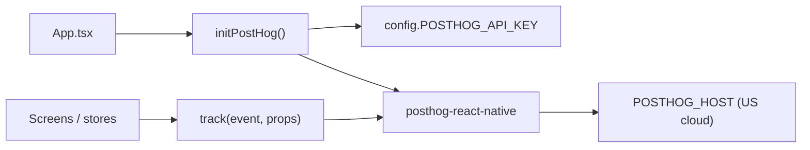

# PostHog analytics in Planora Mobile

Planora Mobile uses [PostHog](https://posthog.com/) for **product analytics** — tracking key user actions (signup, focus sessions, premium funnel, AI usage) without blocking app startup when analytics is disabled or unavailable.

All analytics code lives in one module. Screens call a thin `track()` helper with named events from `AnalyticsEvents`.

---

## Architecture



| Piece | File | Role |
|-------|------|------|
| Config | `src/config/env.ts` | `POSTHOG_API_KEY`, `POSTHOG_HOST` |
| SDK wrapper | `src/analytics/posthog.ts` | Init, `track`, `identify`, event constants |
| App bootstrap | `App.tsx` | Calls `initPostHog()` after first interaction |
| Call sites | Screens + `subscriptionStore` | Fire events at meaningful moments |

PostHog is **optional**:

- If `POSTHOG_API_KEY` is empty → init is skipped, `track()` is a no-op.
- If `posthog-react-native` is not installed → init logs a warning, `track()` is a no-op.

Install the SDK with:

```bash
npm run install:analytics
```

That runs:

```bash
npm install @sentry/react-native posthog-react-native --legacy-peer-deps --no-audit
```

(`posthog-react-native` is not listed in default `dependencies`; Sentry is installed in the same step.)

---

## Configuration

Environment variables are read in `src/config/env.ts`:

```typescript
export const config = {
  POSTHOG_API_KEY: process.env.POSTHOG_API_KEY || '',
  POSTHOG_HOST: process.env.POSTHOG_HOST || 'https://us.i.posthog.com',
  // ...
};
```

Set these in `.env` (or your CI/build env) for production:

```env
POSTHOG_API_KEY=phc_xxxxxxxx
POSTHOG_HOST=https://us.i.posthog.com
```

| Variable | Required | Default | Notes |
|----------|----------|---------|-------|
| `POSTHOG_API_KEY` | Yes (to enable) | `''` | Empty = analytics off |
| `POSTHOG_HOST` | No | `https://us.i.posthog.com` | US PostHog ingest |

---

## Core module (`src/analytics/posthog.ts`)

### Initialization

`initPostHog()` dynamically requires the SDK so the app still runs without it:

```typescript
export async function initPostHog(): Promise<void> {
  if (!config.POSTHOG_API_KEY) return;
  try {
    const PostHog = require('posthog-react-native').default;
    posthog = await PostHog.initAsync(config.POSTHOG_API_KEY, { host: config.POSTHOG_HOST });
  } catch {
    logger.warn('[Planora] posthog-react-native not installed — analytics off');
  }
}
```

Called from `App.tsx` inside `InteractionManager.runAfterInteractions` so startup is not blocked:

```typescript
useEffect(() => {
  initSentry();
  const startupTask = InteractionManager.runAfterInteractions(() => {
    initPostHog();
    // ... other deferred startup work
  });
  return () => startupTask.cancel();
}, [initializeAuth]);
```

### Tracking events

```typescript
export function track(
  event: string,
  properties?: Record<string, string | number | boolean>
): void {
  posthog?.capture?.(event, properties);
}
```

- Safe to call before init finishes (optional chaining).
- Properties are flat key/value (string, number, or boolean only).

### User identification

```typescript
export function identify(userId: string, traits?: Record<string, string>): void {
  posthog?.identify?.(userId, traits);
}
```

**Exported but not used yet.** Typical future use after login:

```typescript
import { identify } from '@/analytics/posthog';

// After successful login
identify(user.id, { email: user.email, plan: 'free' });
```

### Event name constants

All event strings are centralized in `AnalyticsEvents` to avoid typos:

```typescript
export const AnalyticsEvents = {
  ONBOARDING_COMPLETED: 'onboarding_completed',
  SIGNUP_COMPLETED: 'signup_completed',
  GOAL_CREATED: 'goal_created',
  AI_PLAN_GENERATED: 'ai_plan_generated',
  ROUTINE_COMPLETED: 'routine_completed',
  FOCUS_SESSION_STARTED: 'focus_session_started',
  FOCUS_SESSION_ENDED: 'focus_session_ended',
  PREMIUM_UPGRADE_CLICKED: 'premium_upgrade_clicked',
  PAYWALL_VIEWED: 'paywall_viewed',
  PREMIUM_INTEREST: 'premium_interest',
  WAITLIST_JOINED: 'waitlist_joined',
  CONTACT_SUBMITTED: 'contact_submitted',
  WEEKLY_REVIEW_VIEWED: 'weekly_review_viewed',
  WEEKLY_REVIEW_SHARED: 'weekly_review_shared',
} as const;
```

---

## Event catalog (all cases)

### Active events (wired in the app)

| Event | Properties | Where it fires | When |
|-------|------------|----------------|------|
| `onboarding_completed` | — | `OnboardingScreen.tsx` | User finishes onboarding slides |
| `signup_completed` | `method: 'email'` | `RegisterScreen.tsx` | Successful email registration |
| `ai_plan_generated` | `goalId` | `GoalDetailScreen.tsx` | User generates an AI plan for a goal |
| `ai_plan_generated` | `source: 'home'` | `HomeScreen.tsx` | User taps the AI/goals entry on home *(navigation intent, not a real generation)* |
| `focus_session_started` | `mode`, `durationSec` | `FocusScreen.tsx` | User starts a focus timer |
| `focus_session_ended` | `mode`, `completed: true` | `FocusScreen.tsx` | Timer reaches zero |
| `premium_upgrade_clicked` | `source` | `subscriptionStore.ts` via `trackPremiumClick()` | User taps upgrade / waitlist CTA |
| `paywall_viewed` | `source: 'paywall'` | `PaywallScreen.tsx` | Paywall screen mounts |
| `premium_interest` | `source: 'paywall'` | `PaywallScreen.tsx` | User submits waitlist email |
| `waitlist_joined` | `source: 'paywall'` | `PaywallScreen.tsx` | Waitlist API succeeds |
| `weekly_review_viewed` | — | `WeeklyReviewScreen.tsx` | Weekly review API returns data |
| `weekly_review_shared` | — | `WeeklyReviewScreen.tsx` | User shares review via OS share sheet |

#### `premium_upgrade_clicked` sources

| `source` value | Trigger |
|----------------|---------|
| `'profile'` | Profile → “Upgrade to Premium” |
| `'subscription_screen'` | Subscription screen → “Join the waitlist” |

Helper in `src/store/subscriptionStore.ts`:

```typescript
export function trackPremiumClick(source: string) {
  track(AnalyticsEvents.PREMIUM_UPGRADE_CLICKED, { source });
}
```

Usage in Profile:

```typescript
onPress={() => {
  trackPremiumClick('profile');
  navigation.navigate('Subscription');
}}
```

### Reserved events (defined, not wired yet)

These exist in `AnalyticsEvents` but **no screen calls `track()` for them today**:

| Event | Intended use |
|-------|----------------|
| `goal_created` | After creating a new goal |
| `routine_completed` | When a routine period is fully completed |
| `contact_submitted` | Help / contact form submission |

Add `track(AnalyticsEvents.GOAL_CREATED, { ... })` (etc.) when those flows should be measured.

---

## Code examples by feature

### 1. Onboarding

```typescript
import { track, AnalyticsEvents } from '@/analytics/posthog';

const finish = () => {
  track(AnalyticsEvents.ONBOARDING_COMPLETED);
  completeOnboarding();
};
```

### 2. Signup

```typescript
await register(trimmedEmail, password, trimmedName);
track(AnalyticsEvents.SIGNUP_COMPLETED, { method: 'email' });
```

### 3. AI plan generation (real)

```typescript
await generateAIPlan(goalId);
track(AnalyticsEvents.AI_PLAN_GENERATED, { goalId });
```

### 4. Focus timer

```typescript
// Start
track(AnalyticsEvents.FOCUS_SESSION_STARTED, { mode, durationSec: secondsLeft });

// Natural completion
track(AnalyticsEvents.FOCUS_SESSION_ENDED, { mode, completed: true });
```

`mode` is `'pomodoro'` or `'deep'`.

### 5. Premium funnel

```typescript
// Screen view
useEffect(() => {
  track(AnalyticsEvents.PAYWALL_VIEWED, { source: 'paywall' });
}, []);

// User tries to join waitlist
track(AnalyticsEvents.PREMIUM_INTEREST, { source: 'paywall' });
await waitlistService.join(trimmed, 'paywall');
track(AnalyticsEvents.WAITLIST_JOINED, { source: 'paywall' });
```

### 6. Weekly review

```typescript
// After loading review
track(AnalyticsEvents.WEEKLY_REVIEW_VIEWED);

// After share
await Share.share({ message: review.shareableSummary });
track(AnalyticsEvents.WEEKLY_REVIEW_SHARED);
```

---

## How to add a new event

1. **Add the constant** in `src/analytics/posthog.ts`:

   ```typescript
   export const AnalyticsEvents = {
     // ...
     TASK_COMPLETED: 'task_completed',
   } as const;
   ```

2. **Call `track()` at the right moment** (after success, not before):

   ```typescript
   import { track, AnalyticsEvents } from '@/analytics/posthog';

   await completeTask(taskId);
   track(AnalyticsEvents.TASK_COMPLETED, { taskId, source: 'task_list' });
   ```

3. **Keep properties flat** — use strings/numbers/booleans only (matches the `track()` type).

4. **Create the event in PostHog** (optional) — PostHog auto-creates events on first `capture`, but defining them in the PostHog UI helps with dashboards and funnels.

5. **Do not block UX** — never `await track()`; it is synchronous and fire-and-forget.

---

## Funnel example (premium)

Typical sequence you can build in PostHog:

```
premium_upgrade_clicked (source: profile | subscription_screen)
  → paywall_viewed
  → premium_interest
  → waitlist_joined
```

---

## Debugging

| Symptom | Likely cause |
|---------|----------------|
| No events in PostHog | Missing `POSTHOG_API_KEY` or SDK not installed |
| Console: `posthog-react-native not installed` | Run `npm run install:analytics` |
| Events missing properties | Check `track()` second argument at call site |
| Duplicate/confusing `ai_plan_generated` | Home fires it on navigation; Goal Detail fires it on real generation — filter by `goalId` vs `source` in PostHog |

In development, confirm the key is set and rebuild after installing `posthog-react-native`. PostHog’s **Live events** view is the fastest way to verify captures.

---

## Related analytics

Planora also uses **Sentry** (`src/analytics/sentry.ts`) for crashes and errors. PostHog is for **product behavior** only; the two systems are initialized separately in `App.tsx`.

---

## Quick reference

```typescript
// Import
import { track, identify, AnalyticsEvents, initPostHog } from '@/analytics/posthog';

// Init (App.tsx only)
await initPostHog();

// Track
track(AnalyticsEvents.SIGNUP_COMPLETED, { method: 'email' });

// Identify (available, not used yet)
identify(userId, { email: user.email });
```
